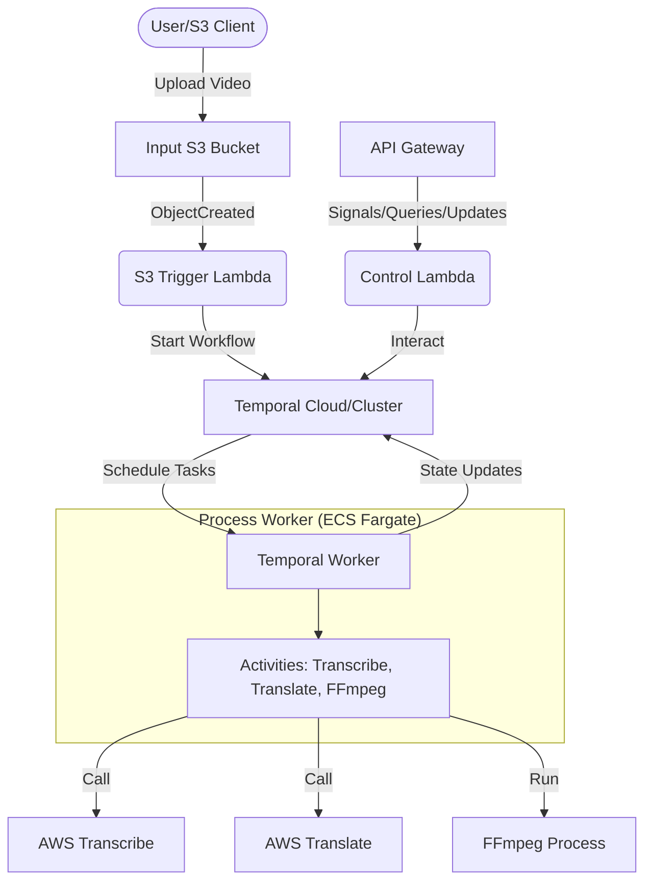

# Video Translation Workflow Skill

Use this skill to build a resilient, scalable media processing pipeline that transcribes, translates, and dubs videos using Temporal, AWS CDK, ECS, and API Gateway.

## Architecture



## Component Implementation

### 1. Temporal Workflow (Durable Orchestration)

Define the `VideoTranslationWorkflow` to handle retries and state transitions.

```typescript
// workflow.ts
import { proxyActivities, defineSignal, defineQuery, setHandler } from '@temporalio/workflow';
import type * as activities from './activities';

const { ingest, transcribe, translate, dub, upload } = proxyActivities<typeof activities>({
  startToCloseTimeout: '20 minutes',
});

export const statusQuery = defineQuery<string>('status');
export const updateSignal = defineSignal<[string]>('update');

export async function videoTranslationWorkflow(input: { bucket: string; key: string }): Promise<string> {
  let status = 'INGESTING';
  setHandler(statusQuery, () => status);

  const localPath = await ingest(input.bucket, input.key);
  
  status = 'TRANSCRIBING';
  const transcript = await transcribe(localPath);
  
  status = 'TRANSLATING';
  const translatedText = await translate(transcript);
  
  status = 'DUBBING';
  const dubbedPath = await dub(localPath, translatedText);
  
  status = 'UPLOADING';
  const finalUrl = await upload(dubbedPath);
  
  status = 'COMPLETED';
  return finalUrl;
}
```

### 2. Activities (Service Integrations)

Activities wrap external services and heavy processing (FFmpeg).

```typescript
// activities.ts
import { TranscribeClient, StartTranscriptionJobCommand } from "@aws-sdk/client-transcribe";
import { TranslateClient, TranslateTextCommand } from "@aws-sdk/client-translate";
import { S3Client, GetObjectCommand } from "@aws-sdk/client-s3";
import { exec } from "child_process";
import { promisify } from "util";

const execPromise = promisify(exec);

export async function transcribe(mediaPath: string) {
    // Implement AWS Transcribe logic here
}

export async function dub(videoPath: string, text: string) {
    // Example FFmpeg command for dubbing
    const command = `ffmpeg -i ${videoPath} -i translated_audio.mp3 -map 0:v -map 1:a -c:v copy -shortest output.mp4`;
    await execPromise(command);
    return "output.mp4";
}
```

### 3. AWS CDK Infrastructure

Use **ECS Express Mode** for simplified deployment of the worker.

```typescript
// worker-stack.ts
import * as ecs from 'aws-cdk-lib/aws-ecs';
import * as lambda from 'aws-cdk-lib/aws-lambda';
import * as iam from 'aws-cdk-lib/aws-iam';

// Ensure the Fargate Task has access to Transcribe, Translate, and S3
const executionRole = new iam.Role(this, 'WorkerRole', {
  assumedBy: new iam.ServicePrincipal('ecs-tasks.amazonaws.com'),
  managedPolicies: [
    iam.ManagedPolicy.fromAwsManagedPolicyName('AmazonS3FullAccess'),
    iam.ManagedPolicy.fromAwsManagedPolicyName('AmazonTranscribeFullAccess'),
    iam.ManagedPolicy.fromAwsManagedPolicyName('TranslateFullAccess'),
  ],
});

// Configure ECS Express Mode Service
const expressService = new ecs.CfnExpressGatewayService(this, 'WorkerService', {
  cluster: cluster.clusterName,
  primaryContainer: {
    image: imageUri,
    environment: [
       { name: 'TEMPORAL_ADDRESS', value: '...' },
    ],
  },
  cpu: '1024', // FFmpeg needs more CPU
  memory: '2048',
});
```

## Implementation Workflow

1.  **Environment Setup**: Connect to Temporal Cloud or deploy a local cluster.
2.  **Activity Development**: Implement the `activities.ts` using the `@aws-sdk/client-transcribe` and `@aws-sdk/client-translate`.
3.  **Worker Dockerization**: Bundle `FFmpeg` into your worker Docker image.
4.  **Lambda Triggers**: Deploy the S3 trigger Lambda to kick off the workflow upon upload.
5.  **API Integration**: Deploy API Gateway with Lambda handlers for `Query`, `Signal`, and `Update`.

## Constraints & Requirements

- **FFmpeg Integration**: For ECS Fargate, install FFmpeg directly in the Docker image.
- **Resource Limits**: Ensure Fargate tasks have sufficient CPU/RAM for media processing.
- **Resilience**: Use Temporal to handle long-running jobs and transient failures.
- **FFmpeg Layer**: `arn:aws:lambda:us-east-1:132260253285:layer:ffmpeg-executable-file:1` (for Lambda components).
